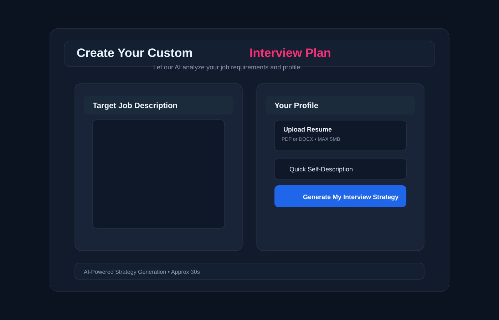
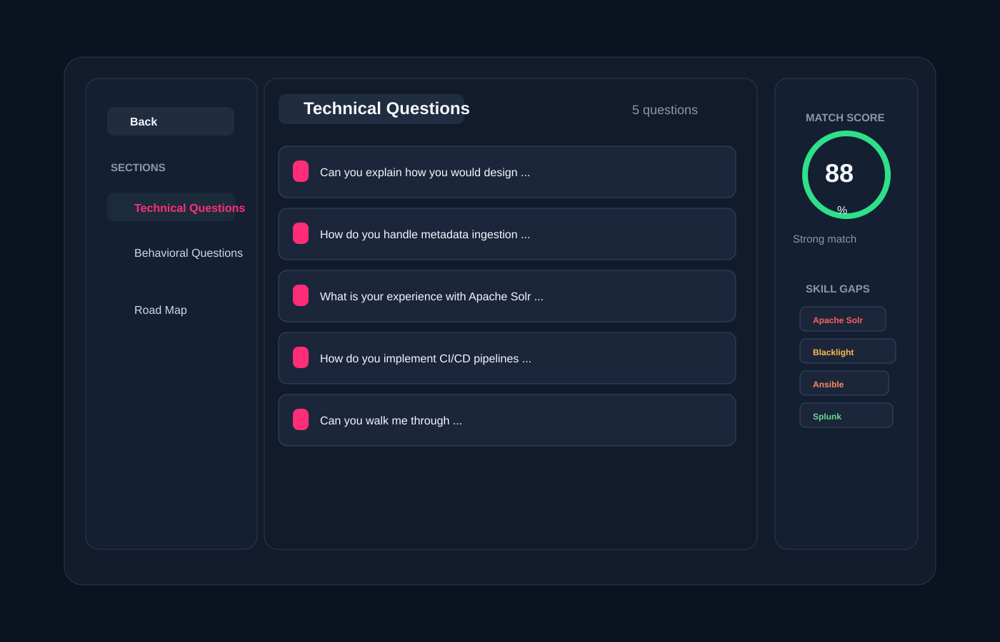

# Job Preparation Application

A full-stack AI-powered interview preparation platform that helps candidates analyze job descriptions, upload resumes, and generate personalized interview strategies, technical/behavioral questions, skill gap analysis, and preparation roadmaps.

<p align="center">
  
</p>

## Overview

This project is designed to help job seekers prepare smarter for interviews by combining resume data, self-description, and the target job description into a tailored preparation report. The platform uses AI to assess candidate fit, highlight weak areas, and generate a custom 5-day interview strategy.

The application is built as a modern web app with a React frontend and an Express backend connected to MongoDB. It supports authentication, resume upload, AI-generated interview analysis, and PDF resume generation.

---

## Why this project matters

Recruiters and hiring teams often look for product thinking, full-stack execution, AI integration, and user-centered design. This project demonstrates:

- Full-stack application architecture
- Secure user authentication
- File upload and document processing
- AI-driven prompt engineering and structured JSON outputs
- Resume and job-matching workflow
- Clean dashboard UI for career prep tools

---

## Tech Stack

### Frontend
- React 19
- Vite
- React Router
- SCSS
- Axios

### Backend
- Node.js
- Express.js
- MongoDB with Mongoose
- JWT Authentication
- Multer for file uploads
- PDF generation via Puppeteer

### AI & Data
- Google Gemini AI
- Zod schema validation
- Structured JSON generation for interview reports

### Dev Tools
- ESLint
- Git
- VS Code

---

## Features

### 1. Personalised interview planning
- User enters a target job description
- Uploads a resume or provides a quick self-description
- AI analyzes the fit between the candidate and the role

### 2. Match score and skill gap analysis
- Generates a match score out of 100
- Identifies skill gaps by severity
- Highlights areas requiring improvement

### 3. AI-generated interview questions
- Technical questions mapped to the role
- Behavioral questions focused on communication and collaboration
- Each question includes intention and answer guidance

### 4. Study roadmap
- A custom 5-day preparation plan
- Focuses on highest-priority technical and behavioral gaps

### 5. User authentication
- Secure sign up and login
- JWT-based protected routes
- User-specific interview history

### 6. Interview history dashboard
- Recently generated interview reports are saved per user
- Users can revisit past strategies

### 7. Resume PDF generation
- Produces a tailored resume PDF based on job description and candidate profile
- Designed to feel recruiter-friendly and ATS-optimized

---

## Product Screens

### Home Dashboard

<p align="center">
  
</p>

### Interview Report View

The report page contains:
- Left sidebar navigation
- Technical and behavioral interview sections
- Match score ring
- Skill gap badges
- Preparation roadmap timeline

---

## Project Architecture

```text
Job Preparation application/
├── Backend/
│   ├── src/
│   │   ├── controllers/
│   │   ├── models/
│   │   ├── routes/
│   │   ├── services/
│   │   ├── middlewares/
│   │   └── config/
│   ├── server.js
│   └── package.json
├── Frontend/
│   ├── src/
│   ├── public/
│   ├── index.html
│   ├── vite.config.js
│   └── package.json
├── .gitignore
├── README.md
└── docs/
```

---

## How it works

1. A user logs in or registers.
2. The candidate enters or uploads:
   - job description
   - resume
   - self-description
3. The backend parses the profile and calls the Gemini AI model.
4. The model returns structured JSON containing:
   - job title
   - match score
   - technical questions
   - behavioral questions
   - skill gaps
   - preparation plan
5. The frontend renders the report and allows users to revisit older reports.

---

## Environment Variables

Create a `.env` file in the `Backend` directory with the following values:

```env
MONGO_URI=your_mongodb_connection_string
JWT_SECRET=your_secret_key
GOOGLE_GENAI_API_KEY=your_google_gemini_api_key
```

---

## Setup Instructions

### 1. Clone the repository

```bash
git clone https://github.com/your-username/job-preparation-application.git
cd job-preparation-application
```

### 2. Install backend dependencies

```bash
cd Backend
npm install
```

### 3. Install frontend dependencies

```bash
cd ../Frontend
npm install
```

### 4. Start the backend

```bash
cd ../Backend
npm run dev
```

### 5. Start the frontend

```bash
cd ../Frontend
npm run dev
```

### 6. Open the app

Visit:

```text
http://localhost:5173
```

---

## API Highlights

### Auth
- Register user
- Login user
- JWT-protected sessions

### Interview generation
- Generate interview strategy based on job description + profile
- Fetch interview report by ID
- Fetch all saved reports
- Download tailored resume PDF

---

## Project Impact

This application is useful for:
- Job seekers preparing for interviews
- Career coaches and mentors
- Hiring teams evaluating candidate readiness
- AI-powered interview prep automation

It blends practical career support with modern AI product experience, making it a strong portfolio project for a software engineer or full-stack developer.

---

## Future Enhancements

- Add multi-role interview simulations
- Support more AI models and comparison mode
- Add mock interviews with voice or chat-based evaluation
- Offer personalized learning paths by skill
- Add analytics dashboard for candidate performance over time

---

## Recruiter Summary

This project demonstrates end-to-end product development across the entire software lifecycle: user flows, authentication, backend APIs, AI integration, data modeling, responsive UI, and deployment-ready architecture. It reflects the ability to build a high-impact, user-focused application that solves a real-world problem using modern web technologies and AI.

---

## License

This project is currently for portfolio and educational use.

---

## Contact

If you would like to connect or discuss this project further, feel free to reach out through the repository owner profile or project contact details.
